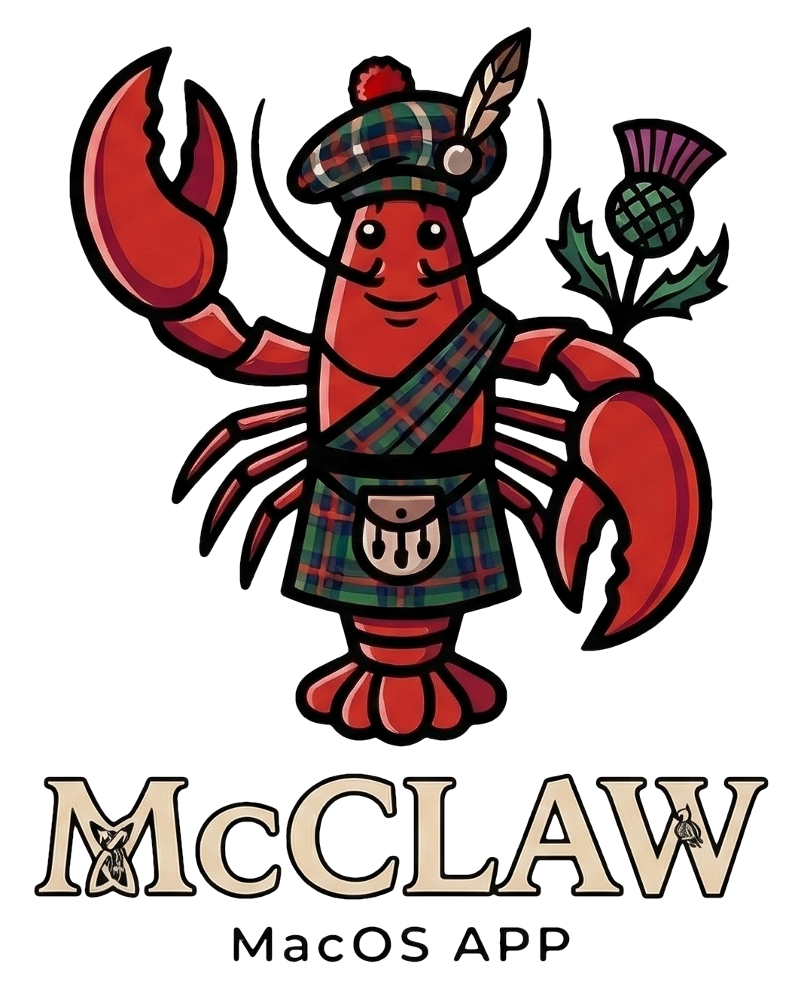

<p align="center">
  
</p>

<h1 align="center">McClaw</h1>

<p align="center">
  <strong>The native macOS AI assistant that bridges all your CLI tools in one place.</strong>
</p>

<p align="center">
  <a href="https://mcclaw.app">Website</a> •
  <a href="#features">Features</a> •
  <a href="#installation">Installation</a> •
  <a href="#building-from-source">Build</a> •
  <a href="#contributing">Contributing</a> •
  <a href="docs/McClaw/00-INDICE.md">Docs</a>
</p>

<p align="center">
  
  
  
  
  
</p>

---

## What is McClaw?

McClaw is a **native macOS application** built with Swift and SwiftUI that unifies multiple AI assistants — Claude, ChatGPT, Gemini, and Ollama — through their official CLI tools. Instead of managing API keys or juggling between different apps, McClaw talks directly to the CLIs you already have installed.

One app. All your AIs. Zero API keys.

## Features

### AI Providers
- **Claude** (Anthropic) — Full streaming support, session management, MCP tools
- **ChatGPT** (OpenAI) — Chat completions via CLI
- **Gemini** (Google) — Multi-modal conversations
- **Ollama** — Local models, fully offline

### Core
- **CLI Bridge Architecture** — Uses official CLI tools, respects provider ToS
- **Unified Chat Interface** — Switch providers mid-conversation, markdown rendering, code highlighting
- **Menu Bar App** — Always accessible, lightweight, stays out of your way
- **Smart CLI Detection** — Auto-discovers installed CLIs, assisted installation for missing ones
- **365 tests** — Comprehensive test suite across 5 SPM targets

### Productivity
- **Canvas Mode** — Live HTML/JS preview panel with hot-reload and bidirectional JS bridge
- **Voice Mode** — Speech-to-text, text-to-speech, push-to-talk, wake word activation
- **Slash Commands** — 9 built-in commands for quick actions
- **File Attachments** — Drag & drop or pick files to include in conversations
- **Session Management** — Persistent chat history with export

### Automation & Integration
- **Scheduled Tasks** — Cron jobs and one-off scheduled prompts
- **30+ Connectors** — Google Workspace, GitHub, Slack, Discord, Telegram, Jira, Notion, Trello, and more
- **MCP Support** — Model Context Protocol server management
- **Channels & Plugins** — Extensible via Gateway WebSocket protocol
- **WordPress MCP Bridge** — 13 sub-connectors for WordPress site management
- **Prompt Enrichment** — `@fetch` directive to inject live data from connectors into prompts

### Security
- **Execution Approvals** — Glob-based allow/deny rules for CLI commands
- **Environment Sanitization** — Strips sensitive env vars before passing to CLIs
- **TCC Compliance** — Proper macOS permission handling (microphone, screen recording, camera, location)
- **Keychain Storage** — OAuth tokens and credentials stored in macOS Keychain

### Advanced
- **Remote Mode** — SSH tunnel support for connecting to remote instances
- **IPC Protocol** — Unix socket communication with HMAC authentication
- **Auto-Updates** — Sparkle framework integration
- **Deep Links** — `mcclaw://` URL scheme support
- **Multi-language** — Localization infrastructure ready (i18n)

## Requirements

- **macOS 15** (Sequoia) or later
- At least one AI CLI installed:
  - [Claude Code](https://docs.anthropic.com/en/docs/claude-code) — `npm install -g @anthropic-ai/claude-code`
  - [ChatGPT CLI](https://platform.openai.com) — Check OpenAI docs for installation
  - [Gemini CLI](https://github.com/google-gemini/gemini-cli) — `npm install -g @anthropic-ai/gemini-cli` (check repo for latest)
  - [Ollama](https://ollama.com) — `brew install ollama`

## Installation

### Download

Get the latest release from [mcclaw.app](https://mcclaw.app) or from [GitHub Releases](https://github.com/joseconti/mc-claw/releases).

### Homebrew (coming soon)

```bash
brew install --cask mcclaw
```

## Building from Source

### Prerequisites

- Xcode 16+ or Swift 6.0+ toolchain
- macOS 15+

### Build

```bash
# Clone the repository
git clone https://github.com/joseconti/mc-claw.git
cd mc-claw

# Build the full app bundle (recommended)
./scripts/build-app.sh

# The app is generated at build/McClaw.app
open build/McClaw.app
```

### Development

```bash
# Quick compile check
cd McClaw && swift build

# Run tests
cd McClaw && swift test

# Build only the binary (no bundle)
cd McClaw && swift run
```

## Architecture

McClaw is built as a **Swift Package Manager** project with 5 modular targets:

| Target | Description |
|--------|-------------|
| **McClaw** | Main executable — SwiftUI app, views, services, state management |
| **McClawKit** | Core library — CLI parsing, security logic, connectors, voice processing |
| **McClawProtocol** | WebSocket protocol models — Request/Response/Event types |
| **McClawIPC** | Inter-process communication — Unix socket with HMAC auth |
| **McClawDiscovery** | Gateway discovery — Bonjour/mDNS service detection |

### Key Design Decisions

- **Actor-based concurrency** — All services use Swift actors for thread safety
- **@Observable pattern** — State management via `@Observable` + `@MainActor`
- **AsyncStream** — Streaming responses from CLIs
- **No API keys required** — Delegates authentication to each CLI's own auth flow

### Dependencies

| Dependency | Purpose |
|-----------|---------|
| [MenuBarExtraAccess](https://github.com/orchetect/MenuBarExtraAccess) | Menu bar window control |
| [swift-log](https://github.com/apple/swift-log) | Structured logging |
| [Sparkle](https://github.com/sparkle-project/Sparkle) | Auto-updates |

## Project Structure

```
mc-claw/
├── McClaw/                    # Swift Package
│   ├── Package.swift
│   ├── Sources/
│   │   ├── McClaw/            # Main app target
│   │   │   ├── App/           # Entry point, AppDelegate
│   │   │   ├── State/         # AppState, ViewModels
│   │   │   ├── Views/         # SwiftUI views (Chat, Settings, Voice, Canvas...)
│   │   │   ├── Services/      # CLIBridge, Gateway, Cron, MCP, Voice, Canvas...
│   │   │   ├── Models/        # Data models (CLI, Chat, Gateway, Connectors...)
│   │   │   └── Infrastructure/ # Config, Logging, Keychain
│   │   ├── McClawKit/         # Core pure-logic library
│   │   ├── McClawProtocol/    # WebSocket protocol types
│   │   ├── McClawIPC/         # Unix socket IPC
│   │   └── McClawDiscovery/   # Gateway discovery
│   └── Tests/                 # 365 tests
├── BundledSkills/             # Built-in skill definitions
├── docs/                      # Architecture documentation
├── scripts/                   # Build and utility scripts
└── SPRINTS.md                 # Development progress tracker
```

## Contributing

We welcome contributions! McClaw is an open-source project and we appreciate help from the community.

Please read our [Contributing Guide](CONTRIBUTING.md) before submitting a pull request.

### Quick Start for Contributors

1. Fork the repository
2. Create a feature branch: `git checkout -b feature/my-feature`
3. Make your changes and ensure tests pass: `cd McClaw && swift test`
4. Build the app to verify: `./scripts/build-app.sh`
5. Submit a pull request

See [CONTRIBUTING.md](CONTRIBUTING.md) for detailed guidelines.

## Documentation

Full architecture documentation is available in the [`docs/McClaw/`](docs/McClaw/) directory:

- [Architecture Overview](docs/McClaw/01-ARQUITECTURA-GENERAL.md)
- [CLI Bridge](docs/McClaw/02-CLI-BRIDGE.md)
- [Chat UI](docs/McClaw/03-UI-CHAT.md)
- [Gateway Protocol](docs/McClaw/04-GATEWAY-PROTOCOL.md)
- [Channels & Plugins](docs/McClaw/05-CHANNELS-PLUGINS.md)
- [Data Models](docs/McClaw/06-MODELOS-DATOS.md)
- [Features Map](docs/McClaw/07-FEATURES-COMPLETAS.md)
- [Connectors](docs/McClaw/09-CONNECTORS-SPRINTS.md)
- [Localization](docs/McClaw/13-LOCALIZACION.md)

## Roadmap

- [ ] Homebrew Cask distribution
- [ ] Native Telegram, Slack, and Discord channels (without Gateway)
- [ ] iOS / Android companion app
- [ ] Plugin marketplace
- [ ] Tier 1 language translations (28 languages)
- [ ] Themes and appearance customization

## License

McClaw is released under the [GNU General Public License v3.0](LICENSE).

## Author

**José Conti** — [plugins.joseconti.com](https://plugins.joseconti.com)

- GitHub: [@joseconti](https://github.com/joseconti)
- X: [@josecontic](https://x.com/josecontic)
- Email: j.conti@joseconti.com

---

<p align="center">
  <a href="https://mcclaw.app">mcclaw.app</a>
</p>
